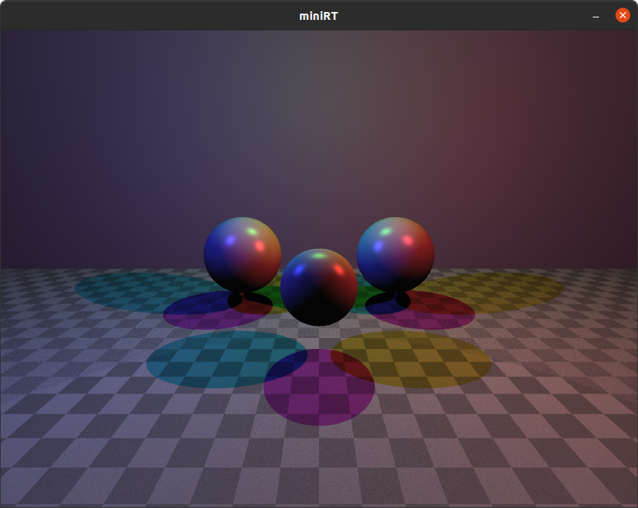
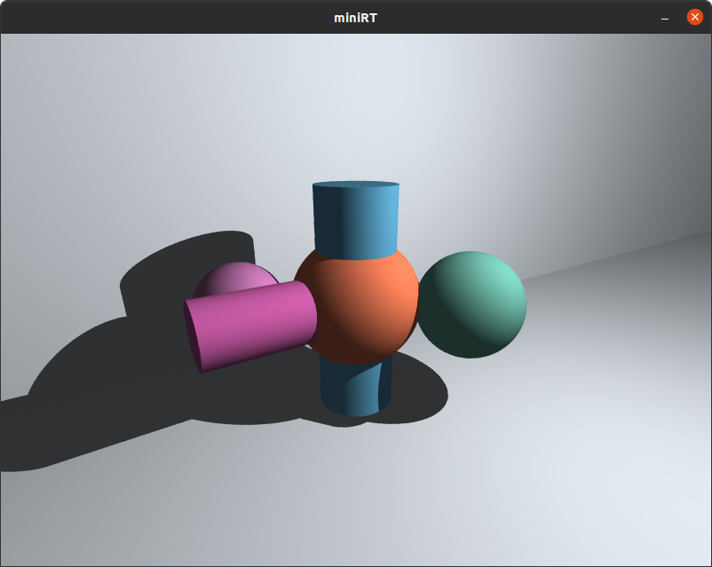

# miniRT

A ray tracer written in C. miniRT renders 3D scenes described in `.rt` files using the ray tracing technique, producing images of geometric objects with realistic lighting.

---

## Screenshots

<p align="center">
  
  &nbsp;&nbsp;
  
</p>

---

## Features

- Ray tracing from scratch in C (no external rendering library)
- Rendering of three geometric primitives: sphere, plane, cylinder
- Phong lighting model: ambient, diffuse, and specular components
- Configurable camera with position, orientation, and field of view
- Scene description via `.rt` text files
- Real-time window rendering through MiniLibX
- Strict input validation with descriptive error messages
- Zero memory leaks (verified with Valgrind)
- Bonus: multi-light support and specular highlights (`make bonus`)

---

## Project Structure

```
miniRT/
├── mandatory/
│   ├── includes/       # miniRT.h — all structs and prototypes
│   └── srcs/
│       ├── main.c
│       ├── graphics/   # Ray casting, lighting, intersection, rendering
│       ├── parsing/    # Scene file parser and validators
│       └── utils/      # Vector math, error handling, memory management
├── bonus/
│   ├── includes/       # miniRT_bonus.h
│   └── srcs/           # Same structure with bonus features
├── libft/              # Custom C standard library
├── minilibx-linux/     # MiniLibX — X11 windowing library
├── scenes/
│   ├── *.rt            # Example scene files
│   └── error/          # Invalid scenes used for error testing
├── assets/             # Screenshots
└── tests/
    └── test_error.sh   # Valgrind memory leak test suite
```

---

## Dependencies

- GCC with `-Wall -Wextra -Werror`
- X11 and Xext development libraries
- MiniLibX (included as `minilibx-linux/`)
- Valgrind (optional, for running the test suite)

On Debian/Ubuntu:

```bash
sudo apt-get install gcc make libx11-dev libxext-dev valgrind
```

---

## Build

```bash
# Mandatory part
make

# Bonus part (multi-light, specular)
make bonus

# Clean object files
make clean

# Full clean (objects + binary)
make fclean

# Rebuild from scratch
make re
```

The binary is named `miniRT` and placed at the project root.

---

## Usage

```bash
./miniRT scenes/basic_sphere.rt
./miniRT scenes/cylinder.rt
./miniRT scenes/solar_system.rt
```

The program opens an 800x600 window and renders the scene. Press `ESC` or close the window to exit.

---

## Scene File Format

Scene files use the `.rt` extension. Each line defines one element.

### Required elements (exactly one each)

| Identifier | Description |
|------------|-------------|
| `A` | Ambient lighting |
| `C` | Camera |
| `L` | Point light |

### Optional objects (one or more)

| Identifier | Description |
|------------|-------------|
| `sp` | Sphere |
| `pl` | Plane |
| `cy` | Cylinder |

### Syntax

```
# Ambient lighting: ratio [0.0–1.0]  R,G,B [0–255]
A 0.2 255,255,255

# Camera: position  orientation [-1.0–1.0]  FOV [0–180]
C 0,0,-30 0,0,1 70

# Point light: position  brightness [0.0–1.0]  R,G,B
L -10,20,-10 0.8 255,200,150

# Sphere: center  diameter  R,G,B
sp 0,0,0 10 255,0,0

# Plane: point  normal  R,G,B
pl 0,-5,0 0,1,0 100,200,100

# Cylinder: center  axis  diameter  height  R,G,B
cy 0,0,0 0,1,0 5 20 0,0,255
```

### Example scene

```
A 0.2 255,240,230
C 0,0,-30 0,0,1 70
L -15,20,-10 0.8 255,200,150

sp 0,0,0 15 255,120,80
pl 0,-10,0 0,1,0 80,80,80
cy 5,0,5 0,1,0 4 20 60,120,200
```

---

## Controls

| Key / Action | Effect |
|---|---|
| `ESC` | Close the window and exit |
| Window close button | Exit the program |

---

## Testing

A Valgrind-based test suite is included in the `tests/` directory. It runs the binary against all invalid scene files in `scenes/error/` and verifies that no memory is leaked on any error path.

```bash
cd tests
bash test_error.sh
```

The test cases cover: duplicate or missing required elements, wrong argument counts, values out of range (color, FOV, brightness, orientation), invalid identifiers, and empty files.

---

## Architecture

### Rendering pipeline

```
.rt file
   └── Parser & Validator
         └── Scene graph (env + objects)
               └── Camera setup
                     └── Per-pixel ray generation
                           └── Intersection tests (sphere / plane / cylinder)
                                 └── Lighting calculation (Phong)
                                       └── MiniLibX pixel write
```

### Key data structures

| Struct | Role |
|--------|------|
| `t_ray` | Origin + direction of a ray |
| `t_hit_record` | Closest intersection point, normal, object type |
| `t_camera_basis` | Precomputed camera axes and viewport dimensions |
| `t_environment` | Ambient, camera, and light |
| `t_object` | Linked lists of spheres, planes, and cylinders |

---

## Author

CAVALLIN Sydney , PROT Coraline — 42 student  
Project: miniRT (42 graphics branch)
